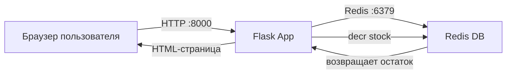

# Лабораторная работа 5.
## Проектирование и реализация комплексной микросервисной системы для автоматизации бизнес-процесса.

### Выполнила: Войнова Е.А.
### Вариант: 2

---

## Цель работы.

Научиться:

- запускать многоконтейнерные приложения;
- организовывать взаимодействие между сервисами;
- использовать Docker Compose для оркестрации;
- изменять бизнес-логику и инфраструктуру проекта;
- работать с Redis как с внешним сервисом хранения данных.

---

## Задание (вариант 2)

1. Реализовать **обратный отсчёт** (склад).  
   Использовать `cache.decr` вместо `cache.incr`.

2. Добавить политику перезапуска **`restart: always`** для веб-сервиса.

3. Сменить базовый образ на **`python:3.9-slim`**.

---

## Архитектура проекта.



### Взаимодействие сервисов.

| Компонент | Технология | Порт | Роль |
|-----------|------------|------|------|
| Web | Flask + Python 3.9-slim | 8000 | Обработка запросов, уменьшение счётчика |
| Redis | redis:alpine | 6379 | Хранение значения stock |

### Бизнес-логика.

1. Начальный остаток на складе: **100** единиц
2. При каждом запросе: `cache.decr('stock', 1)`
3. При остатке ≤ 10 — предупреждение "Осталось мало!"
4. При остатке < 0 — "Товар закончился"

---

## Состав проекта.

| Файл | Назначение |
|------|------------|
| `app.py` | Основное приложение на Flask |
| `Dockerfile` | Сборка образа (python:3.9-slim) |
| `docker-compose.yml` | Оркестрация сервисов (restart: always) |
| `requirements.txt` | Зависимости Python |
| `README.md` | Документация |

## Создание requirements.txt.


## Создание app.py.

``` 
import time
import redis
import json
import os
from datetime import datetime
from flask import Flask

# -------------------------------
# Настройка путей и логирования
# -------------------------------

BASE_DIR = os.path.dirname(os.path.abspath(__file__))

LOG_DIR = os.path.join(BASE_DIR, "logs")

# Создание папки logs автоматически
os.makedirs(LOG_DIR, exist_ok=True)

log_path = os.path.join(LOG_DIR, "debug.log")


def log_debug(msg, data=None, hypothesis_id="APP"):
    try:
        with open(log_path, "a", encoding="utf-8") as f:
            f.write(json.dumps({
                "sessionId": "distributed-system",
                "runId": "docker-compose",
                "hypothesisId": hypothesis_id,
                "location": "app.py",
                "message": msg,
                "data": data or {},
                "timestamp": int(time.time() * 1000),
                "datetime": datetime.now().isoformat()
            }, ensure_ascii=False) + "\n")

    except Exception as exc:
        print("Logging error:", exc)


log_debug("Application started")

# -------------------------------
# Flask application
# -------------------------------

app = Flask(__name__)

# redis — имя контейнера в docker-compose.yml
cache = redis.Redis(
    host="redis",
    port=6379,
    decode_responses=True
)

# -------------------------------
# Работа со счетчиком (обратный отсчёт)
# -------------------------------

# Начальное количество товара на складе
START_QUANTITY = 100

def get_remaining():
    """Уменьшает остаток товара на 1 и возвращает новое значение"""
    retries = 5

    while True:
        try:
            # Проверяем, есть ли ключ 'stock' в Redis
            if not cache.exists('stock'):
                # Если нет — создаём с начальным значением
                cache.set('stock', START_QUANTITY)
                log_debug(
                    "Stock initialized",
                    {"stock": START_QUANTITY},
                    hypothesis_id="STOCK"
                )
            
            # Уменьшаем на 1 (обратный отсчёт)
            remaining = cache.decr('stock', 1)

            log_debug(
                "Stock decreased",
                {"remaining": remaining},
                hypothesis_id="STOCK"
            )

            return remaining

        except redis.exceptions.ConnectionError as exc:
            log_debug(
                "Redis connection error",
                {
                    "error": str(exc),
                    "retries_left": retries
                },
                hypothesis_id="REDIS"
            )

            if retries == 0:
                raise exc

            retries -= 1
            time.sleep(0.5)

# -------------------------------
# Бизнес-логика (на основе остатка)
# -------------------------------

def get_decision(remaining):

    if remaining < 0:
        return {
            "title": "ТОВАР ЗАКОНЧИЛСЯ!",
            "message": "Склад пуст. Пополните запасы.",
            "color": "#c0392b",
            "emoji": "📦❌"
        }

    # Почти закончился
    if remaining <= 10:
        return {
            "title": "ОСТАЛОСЬ МАЛО!",
            "message": f"Осталось всего {remaining} шт. Срочно пополните склад!",
            "color": "#e67e22",
            "emoji": "⚠️"
        }

    # Нормальный остаток
    if remaining <= 30:
        return {
            "title": "Средний остаток",
            "message": f"На складе {remaining} шт. Товар ещё есть.",
            "color": "#2980b9",
            "emoji": "📦"
        }

    # Много товара
    return {
        "title": "Склад укомплектован",
        "message": f"На складе {remaining} шт. Товара достаточно.",
        "color": "#27ae60",
        "emoji": "✅"
    }

# -------------------------------
# Главная страница
# -------------------------------

@app.route("/")
def hello():

    remaining = get_remaining()

    decision = get_decision(remaining)

    log_debug(
        "Decision selected",
        {
            "remaining": remaining,
            "decision": decision["title"]
        },
        hypothesis_id="DECISION"
    )

    return f"""
    <!DOCTYPE html>
    <html lang="ru">

    <head>
        <meta charset="UTF-8">
        <title>Склад "Инновации"</title>

        <style>

            body {{
                font-family: Arial, sans-serif;
                background: #f4f6f8;
                display: flex;
                justify-content: center;
                align-items: center;
                height: 100vh;
                margin: 0;
            }}

            .card {{
                background: white;
                padding: 40px;
                border-radius: 18px;
                box-shadow: 0 10px 30px rgba(0,0,0,0.12);
                text-align: center;
                max-width: 520px;
            }}

            .emoji {{
                font-size: 64px;
            }}

            h1 {{
                color: {decision["color"]};
            }}

            .count {{
                font-size: 48px;
                font-weight: bold;
                color: {decision["color"]};
            }}

            .message {{
                font-size: 18px;
                color: #555;
            }}

            .footer {{
                margin-top: 20px;
                font-size: 13px;
                color: #888;
            }}

        </style>
    </head>

    <body>

        <div class="card">

            <div class="emoji">
                {decision["emoji"]}
            </div>

            <h1>
                {decision["title"]}
            </h1>

            <p class="message">
                {decision["message"]}
            </p>

            <p>
                Остаток на складе:
            </p>

            <div class="count">
                {remaining if remaining >= 0 else 0} шт.
            </div>

            <div class="footer">
                При обновлении страницы забирают 1 единицу товара<br>
                Логи сохраняются в: <strong>logs/debug.log</strong>
            </div>

        </div>

    </body>

    </html>
    """

# -------------------------------
# Healthcheck endpoint
# -------------------------------

@app.route("/health")
def health():

    try:
        cache.ping()

        log_debug(
            "Health check OK",
            hypothesis_id="HEALTH"
        )

        return {
            "status": "ok",
            "redis": "connected"
        }

    except Exception as exc:

        log_debug(
            "Health check failed",
            {"error": str(exc)},
            hypothesis_id="HEALTH"
        )

        return {
            "status": "error",
            "redis": "disconnected"
        }, 500

# -------------------------------
# Запуск приложения
# -------------------------------

if __name__ == "__main__":

    log_debug("Flask application started")

    app.run(
        host="0.0.0.0",
        port=5000,
        debug=True
    )
```
## Создание Dockerfile.
```
FROM python:3.9-slim

WORKDIR /code

COPY requirements.txt requirements.txt

RUN pip install -r requirements.txt

COPY . .

CMD ["python", "app.py"]
```

## Создание docker-compose.yml.
```
version: "3.9"

services:

  web:
    build: .
    restart: always
    ports:
      - "8000:5000"
    depends_on:
      - redis
    volumes:
      - ./logs:/code/logs

  redis:
    image: redis:alpine
    restart: always
    ports:
      - "6379:6379"
```
## Запуск проекта.
```
docker compose up -d --build
```


## Проверка в браузере.


## После обновления.


## Проверка Redis.


## Просмотр логов.


## Выводы:
### 1. Запуск многоконтейнерного приложения.
В ходе работы было успешно запущено многоконтейнерное приложение, состоящее из двух сервисов: `web` (Flask) и `redis`. Запуск осуществляется одной командой `docker compose up -d --build`, что значительно упрощает развертывание системы.

### 2. Организация взаимодействия между сервисами.
Настроено сетевое взаимодействие между контейнерами. Flask-приложение подключается к Redis по имени сервиса `redis`, что является стандартной практикой в Docker Compose. Порт 8000 проброшен на хост-машину для доступа к веб-интерфейсу.

### 3. Использование Docker Compose для оркестрации.
Создан файл `docker-compose.yml`, который описывает оба сервиса, их зависимости, политику перезапуска `restart: always` и проброс портов. Docker Compose обеспечивает удобное управление многоконтейнерным приложением.

### 4. Изменение бизнес-логики и инфраструктуры (вариант 2).
В соответствии с заданием:
- Вместо `cache.incr` использован `cache.decr` — реализован **обратный отсчёт товара на складе**
- Добавлена политика перезапуска **`restart: always`** для веб-сервиса, что обеспечивает автоматическое восстановление при сбоях
- Базовый образ заменён на **`python:3.9-slim`**, что уменьшило размер конечного образа

### 5. Работа с Redis как с внешним сервисом хранения данных.
Redis используется как внешнее хранилище для счётчика `stock`. Значение инициализируется значением 100 и уменьшается на 1 при каждом запросе. Данные сохраняются между перезапусками контейнера, что подтверждается командой `GET stock`.


